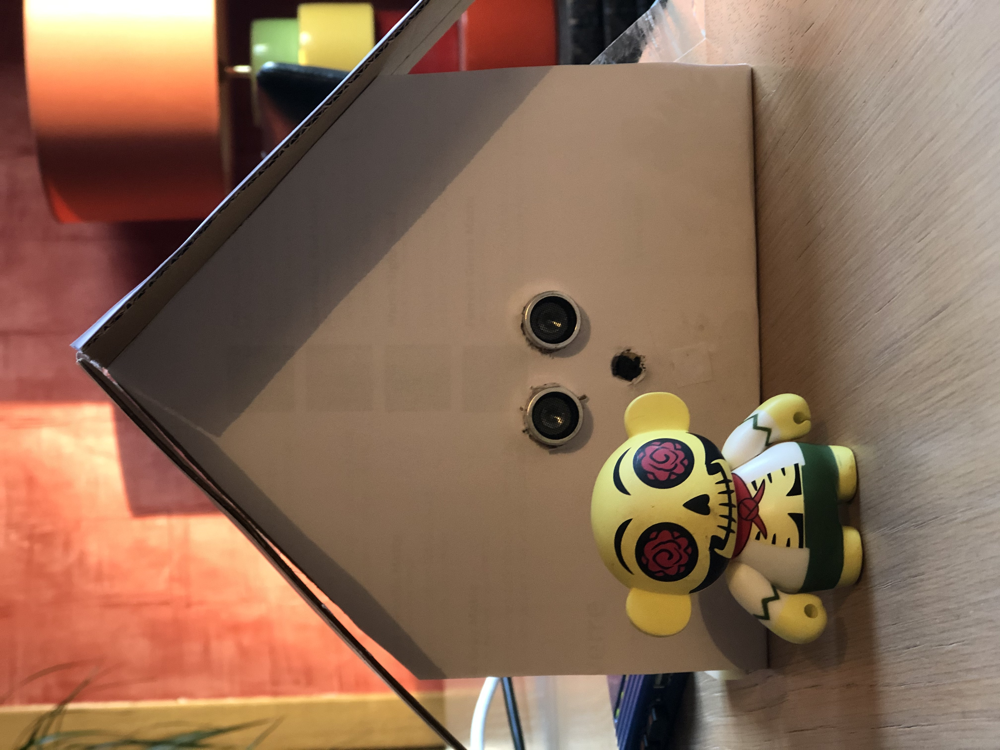
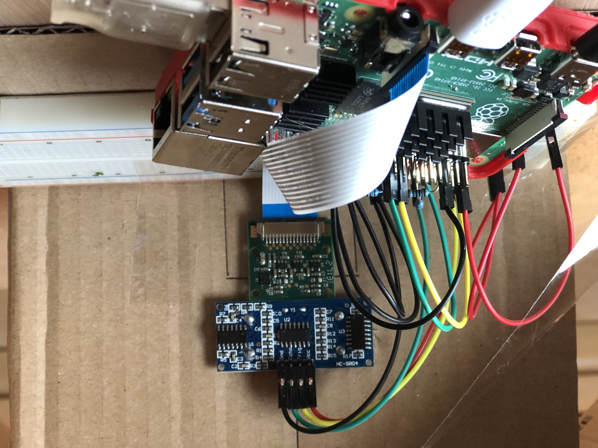
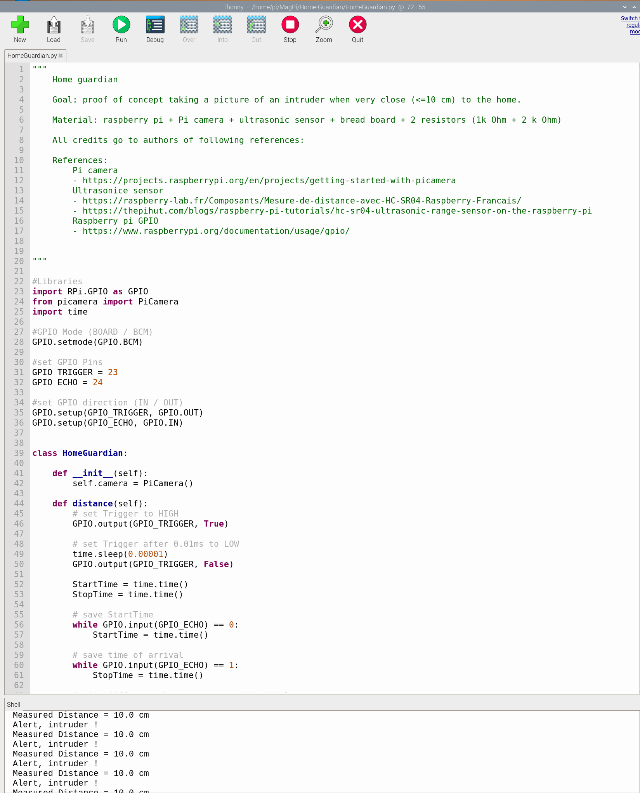
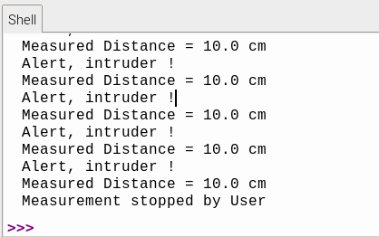

# Home-Guardian
  by dotnetmobile@gmail.com
---

Proof of concept taking a picture of an intruder when very close (&lt;=10 cm) to the home. 

All credits go to authors of followin references: 

* Pi camera
     https://projects.raspberrypi.org/en/projects/getting-started-with-picamera
* Ultrasonice sensor
     https://raspberry-lab.fr/Composants/Mesure-de-distance-avec-HC-SR04-Raspberry-Francais/
     https://thepihut.com/blogs/raspberry-pi-tutorials/hc-sr04-ultrasonic-range-sensor-on-the-raspberry-pi
* Raspberry pi GPIO
     https://www.raspberrypi.org/documentation/usage/gpio/
 
DIY now ;-)

Source code available at: https://github.com/dotnetmobile/Home-Guardian

